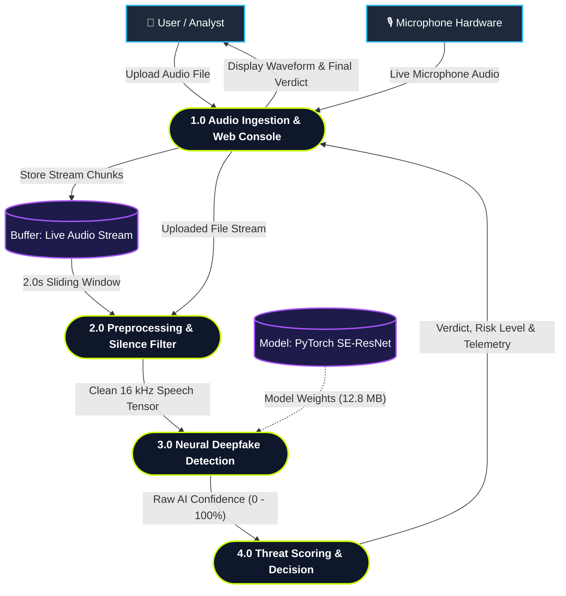
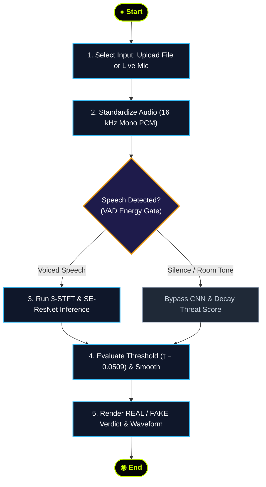
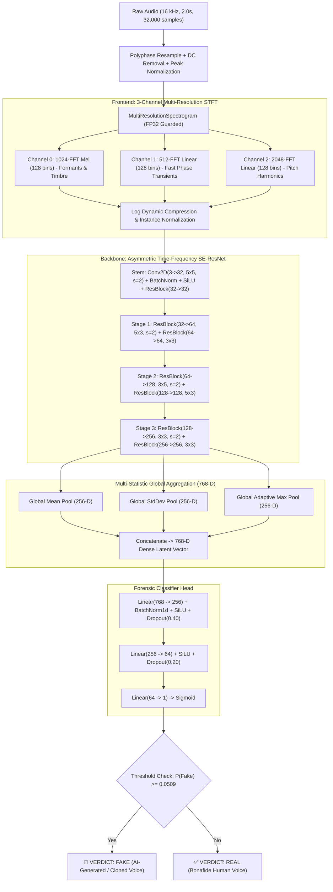

# VocalGuard 🛡️

**Enterprise Forensic Real-Time Audio Deepfake & Neural Voice Cloning Interception System**

[](https://pytorch.org/)
[](https://python.org)
[](https://fastapi.tiangolo.com/)
[](https://react.dev/)
[](https://tailwindcss.com/)
[](https://www.docker.com/)
[]()
[]()
[]()
[]()
[]()

---

## 📌 Table of Contents

- [1. System Overview](#1-system-overview)
  - [The Threat Vector](#the-threat-vector)
  - [The VocalGuard Solution](#the-vocalguard-solution)
  - [System Data Flow (DFD Level 1)](#system-data-flow-dfd-level-1)
  - [System Activity Diagram](#system-activity-diagram)
- [2. Key Features](#2-key-features)
- [3. Forensic Speech Benchmark & Evaluation](#3-forensic-speech-benchmark--evaluation)
  - [Evaluation Metrics (Fake-or-Real Benchmark)](#evaluation-metrics-fake-or-real-benchmark)
  - [Confusion Matrix](#confusion-matrix)
  - [Model Architecture Evolution](#model-architecture-evolution)
  - [Acoustic Signatures Intercepted](#acoustic-signatures-intercepted)
- [4. Deep Learning Model Architecture](#4-deep-learning-model-architecture)
  - [End-to-End Pipeline Diagram](#end-to-end-pipeline-diagram)
  - [Audio Preprocessing & DSP Ingestion](#audio-preprocessing--dsp-ingestion)
  - [Stage 1: 3-Channel Multi-Resolution STFT Frontend](#stage-1-3-channel-multi-resolution-stft-frontend)
  - [Stage 2: Asymmetric Time-Frequency SE-ResNet Backbone](#stage-2-asymmetric-time-frequency-se-resnet-backbone)
  - [Stage 3: Multi-Statistic Global Aggregation (768-D Embedding)](#stage-3-multi-statistic-global-aggregation-768-d-embedding)
  - [Stage 4: Classification Head & Regularization](#stage-4-classification-head--regularization)
  - [Loss Function & Training Dynamics](#loss-function--training-dynamics)
  - [Youden's J Threshold Calibration](#youdens-j-threshold-calibration)
- [5. Backend Architecture & Engine](#5-backend-architecture--engine)
  - [Architecture Overview](#architecture-overview)
  - [Multi-Window Analysis & Voice Activity Gating](#multi-window-analysis--voice-activity-gating)
  - [WebSocket Live Audio Streaming Engine](#websocket-live-audio-streaming-engine)
  - [Session Pool & Concurrency Isolation](#session-pool--concurrency-isolation)
  - [Temporal Smoothing & Application Risk Mapping](#temporal-smoothing--application-risk-mapping)
- [6. API Reference](#6-api-reference)
  - [REST Endpoints](#rest-endpoints)
  - [WebSocket Streaming Protocol](#websocket-streaming-protocol)
- [7. Frontend Architecture & Operations Console](#7-frontend-architecture--operations-console)
- [8. Repository Structure](#8-repository-structure)
- [9. Installation & Quick Start](#9-installation--quick-start)
  - [Prerequisites](#prerequisites)
  - [Backend Setup (FastAPI + PyTorch)](#backend-setup-fastapi--pytorch)
  - [Frontend Setup (React 19 + Vite)](#frontend-setup-react-19--vite)
  - [Running Unit Tests](#running-unit-tests)
- [10. Environment Variables](#10-environment-variables)
- [11. Production & Container Deployment](#11-production--container-deployment)
  - [Docker Containerization](#docker-containerization)
  - [Cloud Platforms (Render & Vercel)](#cloud-platforms-render--vercel)
- [12. Engineering Team & Attribution](#12-engineering-team--attribution)
- [13. License](#13-license)

---

## 1. System Overview

### The Threat Vector
Generative neural speech synthesis architectures (e.g., ElevenLabs, XTTS v2, StyleTTS 2, Tortoise, VITS, HiFi-GAN, BigVGAN) can synthesize convincing voice clones using as little as **3 seconds of reference audio** harvested from social media, voice notes, or phone calls. 

These weaponized voice clones are actively exploited in:
- **Financial Authorization Fraud**: Bypassing voice-biometric banking systems and wire transfers.
- **Executive Impersonation (CEO Fraud)**: Synthesizing executive voices to authorize emergency transfers.
- **Emergency Extortion Scams**: Cloning family members' voices for ransom schemes.
- **VoIP & Telephony Spoofing**: Real-time impersonation during live customer support sessions.

Traditional audio verification tools and human ears fail because these neural systems produce perceptually flawless speech. However, the underlying neural vocoders, transposed convolutions, and parametric decoders introduce distinct mathematical anomalies into the signal's time-frequency phase and harmonic structure.

### The VocalGuard Solution
**VocalGuard** is an open-source, enterprise-grade forensic audio defense platform designed to detect synthetic speech and voice cloning in under **35 milliseconds**.

Rather than relying on resource-intensive multi-gigabyte large language models (LLMs) that analyze semantic transcriptions, VocalGuard inspects the fundamental physical acoustics of the speech signal. Operating on a **PyTorch Multi-Resolution SE-ResNet (v3)** deep learning architecture, VocalGuard extracts concurrent multi-scale spectrograms, applies anisotropic directional convolutions with Squeeze-and-Excitation channel attention, and performs multi-statistic pooling to expose vocoder artifacts, phase discontinuities, and unnatural pitch rigidity.

### System Data Flow (DFD Level 1)



### System Activity Diagram



---

## 2. Key Features

- 🎙️ **Real-Time WebSocket Microphone Streaming (`/ws/detect`):** Streams 16 kHz 16-bit mono PCM audio directly from the browser to the backend with zero disk I/O. Uses isolated circular ring buffers, voice activity detection (VAD), and Exponential Moving Average (EMA) smoothing for stable live predictions.
- 📁 **Universal Multi-Format File Ingestion (`/api/detect`):** Accepts `.wav`, `.mp3`, `.m4a`, `.aac`, `.flac`, `.ogg`, `.webm`, and `.opus` formats through an intelligent 3-tier decoding engine (SoundFile $\to$ TorchAudio $\to$ FFmpeg pipe).
- 🔬 **3-Channel Multi-Resolution STFT Frontend:** Solves Gabor's time-frequency uncertainty limit by decomposing audio simultaneously across 1024-Mel (formants), 512-Linear (high temporal resolution phase transients), and 2048-Linear (high spectral resolution harmonic combs).
- 🧠 **Asymmetric Time-Frequency SE-ResNet Backbone:** Custom CNN backbone using anisotropic $(5 \times 3)$ and $(3 \times 5)$ directional kernels to mirror the physical asymmetry of time vs. frequency, augmented with Squeeze-and-Excitation channel recalibration ($r=8$).
- 📐 **Multi-Statistic Global Pooling (768-D Embedding):** Concatenates Global Mean, Global Standard Deviation, and Adaptive Max Pooling, preventing fleeting 20ms synthetic glitches from being smudged out by traditional Global Average Pooling.
- 🎯 **Scientifically Calibrated Threshold ($\tau^* = 0.0509$):** Calibrated via Youden's $J$ statistic on validation splits to ensure an optimal balance between deepfake recall (93.57%) and human voice verification (93.75%).
- 🛡️ **Voice Activity Detection (VAD) & Silence Gating:** Monitors frame RMS energy and peak amplitude to suppress background silence and ambient room tone, eliminating false positives caused by CNN zero-floor log-spectrogram artifacts.
- 💻 **Cyber-Industrial Operations Console:** Built with React 19, Vite, and Tailwind CSS v4. Features a 60 FPS HTML5 Canvas live waveform visualizer, real-time probability trend graph, pipeline progress stepper, and interactive streaming telemetry logs.
- 🐳 **Lightweight & Production-Ready:** The entire PyTorch model checkpoint occupies only **12.86 MB**. Runs in $<35\text{ms}$ on commodity CPUs and $<8\text{ms}$ on CUDA GPUs. Containerized with Docker for one-click deployment.

---

## 3. Forensic Speech Benchmark & Evaluation

VocalGuard was trained and benchmarked on the official unseen test partition of the **Fake-or-Real (FoR / for-2sec)** forensic speech dataset across diverse generative voice synthesizers and real speaker recordings.

### Evaluation Metrics (Fake-or-Real Benchmark)

*Evaluated on 1,088 unseen evaluation samples (544 Genuine Human / 544 Synthetic Deepfakes):*

| Metric | Score | Specification / Details |
| :--- | :---: | :--- |
| **Test Accuracy** | **93.66%** | **1,019 / 1,088** samples correctly classified |
| **ROC-AUC** | **98.71%** | Area under the Receiver Operating Characteristic curve ($0.9871$) |
| **Equal Error Rate (EER)** | **6.34%** | Point where False Acceptance Rate equals False Rejection Rate |
| **Deepfake Catch Rate (Recall)** | **93.57%** | **509 / 544** synthetic speech samples intercepted (only 35 missed) |
| **Human Voice Specificity** | **93.75%** | **510 / 544** authentic human voices verified (only 34 false alarms) |
| **Precision (Deepfake Class)** | **93.74%** | Ultra-low false alarm rate during spoof detection |
| **F1-Score** | **0.9365** | Harmonic mean of precision and recall |
| **Calibrated Decision Threshold** | **0.0509** | Empirically derived via Youden's $J$ optimization on validation data |
| **Model Checkpoint Size** | **12.86 MB** | PyTorch state dictionary (`voice_deepfake_detector.pth`) |
| **Inference Latency (CPU)** | **~25–35 ms** | Single 2-second audio window on modern multi-core CPU |
| **Inference Latency (GPU)** | **~8 ms** | Single 2-second audio window on NVIDIA Tensor Core GPU |

### Confusion Matrix

```
                          PREDICTED REAL        PREDICTED FAKE
ACTUAL REAL (544) :            510                   34           (Specificity: 93.75%)
ACTUAL FAKE (544) :             35                  509           (Recall / TPR: 93.57%)
```

### Model Architecture Evolution

The architecture was refined through three major developmental phases:

| Capability / Metric | v1: Baseline Naive Model | v2: Dual-Domain Prototype | v3: Multi-Res SE-ResNet (Production) |
| :--- | :--- | :--- | :--- |
| **Frontend Spectrogram** | Single linear spectrogram | 2-channel Mel + Linear STFT | **3-channel Multi-Resolution STFT** |
| **FFT Window Sizes** | $N=1024$ only | $N=1024$ Mel + $N=1024$ Linear | **$N_1=1024$ (Mel), $N_2=512$ (Time), $N_3=2048$ (Freq)** |
| **Backbone Architecture** | Standard ResNet-18 | ResNet-34 variant | **Time-Frequency Asymmetric SE-ResNet** |
| **Convolution Kernels** | Standard isotropic $(3 \times 3)$ | Standard isotropic $(3 \times 3)$ | **Anisotropic $(5 \times 3)$ & $(3 \times 5)$ kernels** |
| **Channel Attention** | None | SE blocks in stages 3 & 4 | **SE-Attention ($r=8$) across all stages** |
| **Global Pooling Strategy** | Standard AvgPool (1D) | AvgPool + MaxPool (512-D) | **Multi-Statistic (Mean + Std + Max = 768-D)** |
| **Loss Function** | Standard Binary CrossEntropy | BCE with Label Smoothing | **Binary Focal Loss ($\gamma=2.0, \alpha=0.5, \epsilon=0.05$)** |
| **Data Augmentation** | None | Random time shifting | **Spectral Mixup ($\alpha=0.2, p=0.5$) + Time Crop** |
| **Decision Threshold** | Fixed $0.500$ (Failed) | Fixed $0.500$ | **Dynamic Youden's Index Calibration ($\tau^*=0.0509$)** |
| **Overall Test Accuracy** | 51.93% *(Classifier collapsed)* | 79.50% | **93.66%** |
| **Deepfake Catch Rate** | 3.86% *(523 fakes missed)* | 79.60% *(111 fakes missed)* | **93.57% (509 of 544 fakes intercepted)** |
| **Test ROC-AUC** | ~0.5312 | 0.8693 | **0.9871** |

### Acoustic Signatures Intercepted

Modern vocoders produce artifacts imperceptible to human ears, but glaring to multi-resolution spectral analysis:

1. **Vocoder Upsampling & Checkerboard Patterns:** Neural vocoders (HiFi-GAN, MelGAN) use transposed 1D/2D convolutions to upsample mel frames into time-domain waveforms. This generates subtle periodic energy spikes in high-frequency bands ($>5\text{ kHz}$).
2. **Phase Incoherence & Splicing Discontinuities:** Neural text-to-speech models struggle with continuous glottal phase transitions during sudden plosive consonants (`/p/`, `/t/`, `/k/`) and fricatives (`/s/`, `/sh/`), leaving telltale micro-clicks visible in short-window STFTs.
3. **Unnatural Harmonic Rigidity:** Human speech exhibits biological micro-instability known as *jitter* (pitch period perturbation) and *shimmer* (amplitude perturbation). Synthesized voices exhibit unnatural harmonic rigidity and mathematically perfect pitch tracks.
4. **Spectral Tilt & Cutoff Holes:** Diffusion and autoregressive acoustic models often exhibit abnormal high-frequency spectral rolloff or band-limited dropouts beyond $7.5\text{ kHz}$.

---

## 4. Deep Learning Model Architecture

### End-to-End Pipeline Diagram



### Audio Preprocessing & DSP Ingestion

Every audio stream or file input is standardized to the model's native coordinate frame:
1. **Multi-Backend Decoding:** Attempts reading through `soundfile`; falls back to `torchaudio`; if both fail, spawns an asynchronous `ffmpeg` sub-pipe to decode any container format into raw IEEE 754 32-bit float PCM.
2. **Stereo Downmixing:** Multi-channel audio is averaged across the channel axis to produce a single mono track:
   $$\mathbf{x}_{\text{mono}} = \frac{1}{C}\sum_{c=1}^{C} \mathbf{x}_{c}$$
3. **Polyphase Resampling:** If the native sample rate differs from $16{,}000\text{ Hz}$, `scipy.signal.resample_poly` performs low-pass filtered rational resampling using the greatest common divisor:
   $$u = \frac{16000}{\gcd(f_s, 16000)}, \quad d = \frac{f_s}{\gcd(f_s, 16000)}$$
4. **DC Offset Removal:** Corrects microphone bias drift:
   $$\mathbf{x} \leftarrow \mathbf{x} - \frac{1}{N}\sum_{i=1}^{N} x_i$$
5. **Peak Amplitude Normalization:** Centers waveform dynamics into the range $[-1.0, 1.0]$:
   $$\mathbf{x} \leftarrow \frac{\mathbf{x}}{\max(|\mathbf{x}|) + 10^{-8}}$$
6. **Window Framing:** Clips audio into 2.0-second analysis windows ($32{,}000\text{ samples}$ at $16\text{ kHz}$) with a 1.0-second sliding hop ($16{,}000\text{ samples}$).

---

### Stage 1: 3-Channel Multi-Resolution STFT Frontend

Standard audio models rely on a single spectrogram, which is bounded by **Gabor's Uncertainty Principle** ($\Delta t \cdot \Delta f \ge \frac{1}{4\pi}$). Increasing window length improves frequency resolution but blurs temporal transient clicks; shortening window length resolves clicks but smudges harmonic pitch overtones.

VocalGuard bypasses this constraint by computing a **3-channel multi-resolution tensor**:

$$\mathbf{X} \in \mathbb{R}^{B \times 3 \times F \times T}$$

| Channel | STFT Parameters | Target Acoustic Dimension | Forensic Utility |
| :---: | :--- | :--- | :--- |
| **0** | $N_{\text{fft}}=1024$, $\text{hop}=256$, $\text{win}=1024$, $128\text{ Mel bins}$ | **Perceptual Mel Spectrum** ($20–8{,}000\text{ Hz}$) | Captures human vocal tract biology, phonetic formant trajectories, and vowel acoustic envelopes. |
| **1** | $N_{\text{fft}}=512$, $\text{hop}=256$, $\text{win}=512$, $128\text{ Linear bins}$ | **High Temporal Resolution** ($\Delta t \approx 16\text{ ms}$) | Exposes vocoder frame splicing clicks, unvoiced fricative anomalies, and sudden phase cancellations. |
| **2** | $N_{\text{fft}}=2048$, $\text{hop}=256$, $\text{win}=2048$, $128\text{ Linear bins}$ | **High Spectral Resolution** ($\Delta f \approx 7.8\text{ Hz}$) | Isolates individual pitch harmonic overtones, comb-filter notches, and unnatural pitch rigidity. |

#### Numerical Stability Guards
To protect against NaN propagation during backpropagation, power spectrograms undergo dynamic range compression and per-channel instance normalization:
$$\mathbf{S}_{\text{log}} = \log\left(\text{clamp}(\mathbf{S}, \min=10^{-5})\right)$$
$$\hat{\mathbf{X}}_c = \frac{\mathbf{S}_{\text{log}, c} - \mu_c}{\sigma_c + 10^{-5}}$$

Channels 1 and 2 are adaptively average-pooled along the frequency dimension to match Channel 0's 128 bins, yielding a unified tensor shape of `(B, 3, 128, 126)`.

---

### Stage 2: Asymmetric Time-Frequency SE-ResNet Backbone

Spectrograms are **anisotropic**: the horizontal axis represents *time* (chronological sequence), while the vertical axis represents *frequency* (acoustic pitch). Standard vision models with square $(3 \times 3)$ kernels treat both dimensions identically, causing feature blurring.

VocalGuard's backbone uses **alternating directional anisotropic kernels**:
- **Wide Kernels $(5 \times 3)$:** Broad temporal receptive field to track formant decay and phoneme transitions across time frames.
- **Tall Kernels $(3 \times 5)$:** Tall frequency receptive field to capture vertical harmonic overtone stacks and pitch combs.

#### Squeeze-and-Excitation (SE) Channel Attention
Every residual block includes an SE attention unit with reduction ratio $r=8$:
$$\mathbf{z} = \text{AdaptiveAvgPool2D}(\mathbf{X}) \quad \in \mathbb{R}^{C \times 1 \times 1}$$
$$\mathbf{s} = \sigma\left(\mathbf{W}_2 \cdot \text{SiLU}(\mathbf{W}_1 \mathbf{z})\right)$$
$$\mathbf{\tilde{X}} = \mathbf{s} \odot \mathbf{X}$$

SE recalibrates channel weights dynamically, boosting channels that detect high-frequency vocoder distortion while attenuating ambient room tone.

#### Layer Architecture & Tensor Shapes

| Stage | Layer Component | Kernels / Dims | Output Channels | Output Tensor Shape |
| :---: | :--- | :---: | :---: | :---: |
| **Input** | Audio Tensor | — | 3 | `(B, 3, 128, 126)` |
| **Stem** | ConvBNAct + ResidualBlock | $(5 \times 5), s=2$ then $(3 \times 3)$ | 32 | `(B, 32, 64, 63)` |
| **Stage 1** | ResBlock 1 + ResBlock 2 | $(5 \times 3), s=2$ then $(3 \times 3)$ | 64 | `(B, 64, 32, 32)` |
| **Stage 2** | ResBlock 3 + ResBlock 4 | $(3 \times 5), s=2$ then $(5 \times 3)$ | 128 | `(B, 128, 16, 16)` |
| **Stage 3** | ResBlock 5 + ResBlock 6 | $(3 \times 3), s=2$ then $(3 \times 3)$ | 256 | `(B, 256, 8, 8)` |

---

### Stage 3: Multi-Statistic Global Aggregation (768-D Embedding)

Conventional vision architectures apply Global Average Pooling (GAP) before the classifier. In audio forensics, GAP is inadequate: **a 20ms vocoder click will be averaged out over a 2-second window**.

VocalGuard computes three parallel spatial statistics over the $8 \times 8$ feature grid:
$$\mathbf{v}_{\text{mean}} = \frac{1}{HW}\sum_{i=1}^{H}\sum_{j=1}^{W} \mathbf{F}_{c, i, j} \quad \in \mathbb{R}^{256}$$
$$\mathbf{v}_{\text{std}} = \sqrt{\frac{1}{HW}\sum_{i=1}^{H}\sum_{j=1}^{W} (\mathbf{F}_{c, i, j} - \mathbf{v}_{\text{mean}})^2 + 10^{-6}} \quad \in \mathbb{R}^{256}$$
$$\mathbf{v}_{\text{max}} = \max_{i, j} \mathbf{F}_{c, i, j} \quad \in \mathbb{R}^{256}$$
$$\mathbf{v}_{\text{pooled}} = \left[ \mathbf{v}_{\text{mean}} \;\Vert\; \mathbf{v}_{\text{std}} \;\Vert\; \mathbf{v}_{\text{max}} \right] \quad \in \mathbb{R}^{768}$$

- $\mathbf{v}_{\text{mean}}$ captures **overall acoustic timbre and background profile**.
- $\mathbf{v}_{\text{std}}$ captures **energy variance and dynamic range stability**.
- $\mathbf{v}_{\text{max}}$ catches **fleeting localized synthetic artifacts and click glitches**.

---

### Stage 4: Classification Head & Regularization

The 768-D representation is processed through a regularized classification head:
$$\mathbf{h}_1 = \text{Dropout}_{0.40}\left(\text{SiLU}\left(\text{BatchNorm1d}(\mathbf{W}_1 \mathbf{v}_{\text{pooled}})\right)\right) \quad (\mathbf{W}_1: 768 \to 256)$$
$$\mathbf{h}_2 = \text{Dropout}_{0.20}\left(\text{SiLU}\left(\mathbf{W}_2 \mathbf{h}_1\right)\right) \quad (\mathbf{W}_2: 256 \to 64)$$
$$\hat{y} = \mathbf{W}_3 \mathbf{h}_2 \quad (\mathbf{W}_3: 64 \to 1)$$
$$P(\text{Fake}) = \sigma(\hat{y}) = \frac{1}{1 + e^{-\hat{y}}}$$

---

### Loss Function & Training Dynamics

#### 1. Binary Focal Loss with Label Smoothing
To prevent common bonafide speech patterns from dominating the gradient updates, we utilize **Binary Focal Loss** ($\gamma = 2.0$, $\alpha = 0.5$):
$$p_t = \begin{cases} \sigma(\hat{y}), & \text{if } y = 1 \\ 1 - \sigma(\hat{y}), & \text{if } y = 0 \end{cases}$$
$$\mathcal{L}_{\text{Focal}} = -\alpha_t (1 - p_t)^\gamma \log(p_t + 10^{-8})$$

For hard synthetic samples ($p_t \approx 0.5$), $(1 - p_t)^\gamma = 0.25$, driving active parameter updates. For easy samples ($p_t \approx 0.98$), the factor drops to $(0.02)^2 = 0.0004$, mitigating over-fitting.

Target labels undergo smoothing with $\epsilon = 0.05$:
$$y_{\text{smooth}} = y(1 - \epsilon) + 0.5\epsilon = \begin{cases} 0.975, & y = 1 \\ 0.025, & y = 0 \end{cases}$$

#### 2. Spectral Mixup Data Augmentation
Applied during training with probability $p = 0.5$:
$$\lambda \sim \text{Beta}(\alpha=0.2, \alpha=0.2)$$
$$\mathbf{\tilde{X}} = \lambda \mathbf{X}_i + (1 - \lambda)\mathbf{X}_j, \quad \tilde{y} = \lambda y_i + (1 - \lambda)y_j$$
Mixup establishes smooth decision boundaries, preventing memorization of speaker quirks.

#### 3. Optimization Parameters
- **Optimizer:** AdamW ($\beta_1 = 0.9, \beta_2 = 0.999, \text{weight decay} = 0.01$)
- **Scheduler:** OneCycleLR ($\eta_{\text{max}} = 2 \times 10^{-4}$ with 20% warm-up, annealing to $\eta_{\text{min}} = 2 \times 10^{-7}$)
- **Gradient Clipping:** Strict norm threshold $\|\mathbf{g}\|_2 \le 1.0$

---

### Youden's J Threshold Calibration

Standard binary classifiers assume a default cutoff of $\tau = 0.500$. Because Focal Loss shifts the probability distribution toward conservative estimates, setting $\tau = 0.500$ degrades sensitivity.

During validation, the decision threshold was swept across 1,000 candidate values $\tau \in [0.001, 0.999]$ using **Youden's $J$ statistic**:
$$J(\tau) = \text{Sensitivity}(\tau) + \text{Specificity}(\tau) - 1 = \text{TPR}(\tau) - \text{FPR}(\tau)$$
$$\tau^* = \arg\max_\tau J(\tau) = \mathbf{0.0509}$$

At the calibrated threshold $\tau^* = 0.0509$:
- $P(\text{Fake}) \ge 0.0509 \implies$ **FAKE / SYNTHETIC**
- $P(\text{Fake}) < 0.0509 \implies$ **REAL / BONAFIDE**

This value is stored directly inside the model checkpoint dictionary (`checkpoint["threshold"]`) and loaded automatically at startup.

---

## 5. Backend Architecture & Engine

The backend is built with **FastAPI** and **Uvicorn**, delivering high-throughput inference through asynchronous non-blocking event loops.

```
                     ┌────────────────────────────────┐
                     │     HTTP & WebSocket Clients   │
                     └───────────────┬────────────────┘
                                     │
                 ┌───────────────────┴───────────────────┐
                 ▼                                       ▼
       [ POST /api/detect ]                     [ WS /ws/detect ]
   (Multi-format Audio Upload)             (Real-Time PCM Microphone)
                 │                                       │
                 ▼                                       ▼
       load_audio_from_bytes()                 StreamingSession Pool
   (SoundFile / TorchAudio / FFmpeg)        (Ring Buffer: 64k samples / 4.0s)
                 │                                       │
                 ▼                                       ▼
       VAD Energy Filter                       VAD Energy Filter
   (RMS >= 0.008 & 4% Peak)                 (RMS >= 0.003 & Peak >= 0.006)
                 │                                       │
                 ▼                                       ▼
       Multi-Window Evaluator                  asyncio.to_thread()
       (2.0s win, 1.0s hop)                    (Offloaded Inference Hop)
                 │                                       │
                 ▼                                       ▼
       DetectorManager Singleton ──────────────► Temporal EMA Smoothing
       (SE-ResNet v3 Checkpoint)               (alpha=0.35, Consecutive Risk)
                 │                                       │
                 ▼                                       ▼
       JSON Forensic Verdict                   WebSocket Prediction Frame
```

### Multi-Window Analysis & Voice Activity Gating

For uploaded files, the backend uses a sliding window evaluator:
1. **Window Generation:** Slices audio into 2.0-second chunks ($32{,}000\text{ samples}$) with a 1.0-second hop ($16{,}000\text{ samples}$).
2. **VAD Silence Gating:** Silent or quiet audio windows (RMS $< 0.008$ or peak $< 0.04 \times \text{peak}_{\text{file}}$) are gated out from the consensus decision. This prevents quiet background tone from triggering false alarms.
3. **Consensus Decision Logic:**
   - **Short files ($\le 2–3\text{s}$):** Evaluates the primary window directly.
   - **Long files ($>3\text{s}$):** Requires either **sustained localized synthetic segments** ($\ge 4$ consecutive windows with $P(\text{Fake}) \ge 0.50$) or **majority consensus** ($\ge 65\%$ of voiced windows exceeding $\tau^*$).

---

### WebSocket Live Audio Streaming Engine

The live microphone pipeline (`api/streaming_detector.py`) handles continuous audio streaming:

- **Audio Format:** Signed 16-bit little-endian mono PCM (`pcm_s16le`) at $16{,}000\text{ Hz}$.
- **Zero Disk Writes:** Audio remains entirely in volatile memory.
- **Pre-Allocated Ring Buffer:** Pre-allocates a 4.0-second circular buffer ($64{,}000\text{ samples}$, float32). Older audio is shifted left when capacity is reached.
- **Startup Guarantee:** Inference is never performed on incomplete windows during live streaming; the engine buffers until a full 2.0-second window ($32{,}000\text{ samples}$) is captured before evaluating.
- **1.0-Second Hops:** Evaluates an inference window every 1.0 second of incoming audio ($16{,}000\text{ samples}$).
- **Thread-Pool Offloading:** PyTorch inference is wrapped in `asyncio.to_thread()`, keeping the WebSocket event loop responsive.

---

### Session Pool & Concurrency Isolation

- Each client connection initializes an isolated `StreamingSession` with a unique UUID.
- Sessions maintain independent ring buffers, EMA metrics, and consecutive threat counters.
- Bounded capacity: Protected by `STREAM_MAX_ACTIVE_SESSIONS` (default `16`), `STREAM_MAX_CHUNK_BYTES` ($256\text{ KB}$), and `STREAM_MAX_SECONDS` ($3600\text{s}$).

---

### Temporal Smoothing & Application Risk Mapping

To prevent single-frame anomalies from causing flickering alerts, streaming probabilities are smoothed using an **Exponential Moving Average (EMA)** ($\alpha = 0.35$):
$$\bar{P}_t = \alpha \cdot P_t + (1 - \alpha) \cdot \bar{P}_{t-1}$$

When silence is detected, the CNN is bypassed and $\bar{P}_t$ is decayed:
$$\bar{P}_t \leftarrow \max(0.0, \; \bar{P}_{t-1} \times 0.90)$$

Predictions are categorized into three operational risk tiers:
- **`LOW` (REAL):** Smoothed score $< \tau^*$ and no sustained spikes.
- **`MEDIUM` (SUSPICIOUS):** Smoothed score $\ge \tau^*$ or raw score $\ge 0.15$.
- **`HIGH` (HIGH_RISK):** Smoothed score $\ge 0.35$ or $\ge 3$ consecutive threat windows.

---

## 6. API Reference

### REST Endpoints

#### 1. Health Check
```http
GET /api/health
```
**Response (200 OK):**
```json
{
  "status": "healthy",
  "service": "VocalGuard Deepfake Detection Engine",
  "model_loaded": true,
  "device": "cpu",
  "threshold": 0.0509,
  "checkpoint": "voice_deepfake_detector.pth",
  "allowed_origins": ["*"],
  "streaming_enabled": true,
  "streaming_active_sessions": 0
}
```

#### 2. Detect Audio File
```http
POST /api/detect
Content-Type: multipart/form-data
```
**Parameters:**
- `file` *(UploadFile, required)*: Binary audio file (`.wav`, `.mp3`, `.m4a`, `.aac`, `.flac`, `.ogg`, `.webm`, `.opus`).
- `threshold` *(float, optional)*: Override calibrated decision threshold (default: `0.0509`).

**Response (200 OK):**
```json
{
  "verdict": "FAKE",
  "is_fake": true,
  "threat_score": 93.6,
  "threat_probability": 0.9357,
  "fake_probability_pct": 93.57,
  "real_probability_pct": 6.43,
  "threshold": 0.0509,
  "alert_level": "CRITICAL",
  "decision_rationale": "primary_and_consensus_fake",
  "latency_ms": 28.4,
  "file_name": "ai_generated_speech.mp3",
  "file_size_bytes": 57069,
  "audio_metrics": {
    "duration_seconds": 2.14,
    "original_sample_rate": 24000,
    "processed_sample_rate": 16000,
    "total_samples": 34240,
    "windows_analyzed": 2,
    "voiced_windows_analyzed": 2,
    "peak_amplitude": 0.9782,
    "rms_energy": 0.0841,
    "spectral_centroid_hz": 2154.6
  },
  "spectral_flags": {
    "phase_anomaly": "ERR_PHASE",
    "vocoder_artifacts": "SYNTH_MATCH",
    "prosody_stability": "UNNATURAL"
  },
  "windows": [
    {
      "start_time": 0.0,
      "end_time": 2.0,
      "fake_probability": 0.9412,
      "fake_percentage": 94.12,
      "rms_energy": 0.0862,
      "is_fake": true
    }
  ]
}
```

#### 3. List Demo Samples
```http
GET /api/samples
```
Returns bundled demo audio files for testing (`ai_generated_speech.mp3`, `ai_synthetic_voicemaker.mp3`, `real_human_voice.m4a`).

---

### WebSocket Streaming Protocol

```http
WS /ws/detect
```

#### Client $\to$ Server Control Messages

1. **Start Stream:**
   ```json
   { "type": "start", "format": "pcm_s16le", "sample_rate": 16000, "channels": 1 }
   ```
2. **Binary Audio Chunks:** Stream raw little-endian signed 16-bit mono PCM chunks.
3. **Ping:** `{ "type": "ping" }`
4. **Stop Stream:** `{ "type": "stop" }`

#### Server $\to$ Client Messages

- **Status / Buffering Frame:**
  ```json
  {
    "type": "status",
    "session_id": "a1b2c3d4",
    "state": "BUFFERING",
    "buffered_seconds": 1.2,
    "target_seconds": 2.0,
    "message": "Buffering live audio stream (1.2s / 2.0s)..."
  }
  ```
- **Prediction Frame:**
  ```json
  {
    "type": "prediction",
    "session_id": "a1b2c3d4",
    "timestamp": 1725800000.123,
    "stream_duration_sec": 4.0,
    "window_start": 2.0,
    "window_end": 4.0,
    "fake_probability": 0.8842,
    "real_probability": 0.1158,
    "smoothed_fake_probability": 0.7915,
    "fake_percentage": 88.42,
    "smoothed_percentage": 79.15,
    "prediction": "FAKE",
    "risk_level": "HIGH",
    "state": "HIGH_RISK",
    "is_fake": true,
    "is_smoothed_fake": true,
    "threshold": 0.0509,
    "rms_energy": 0.0612,
    "peak_amplitude": 0.7814,
    "spectral_flags": {
      "phase_anomaly": "ERR_PHASE",
      "vocoder_artifacts": "SYNTH_MATCH",
      "prosody_stability": "UNNATURAL"
    },
    "consecutive_threat_count": 3,
    "inference_ms": 14.8
  }
  ```

---

## 7. Frontend Architecture & Operations Console

The frontend is an industrial cyber-defense console built on **React 19**, **Vite**, and **Tailwind CSS v4**.

```
src/
├── App.jsx             <- Master application: Router, State, Operations Console, Telemetry
├── App.css             <- Custom styles, animations, and scanline effects
├── index.css           <- Tailwind CSS v4 directives & typography rules
└── main.jsx            <- React 19 entrypoint
```

### Core Views & Components

1. **Landing Page:** Interactive presentation detailing threat vectors, system metrics, and an animated SVG Neural Flow diagram visualizing tensor propagation from raw audio to STFT channels, SE-ResNet, and pooling heads.
2. **Operations Console (`LiveDashboard`):**
   - **Dual Ingestion Modes:** File upload with drag-and-drop zone, or live microphone streaming.
   - **60 FPS Waveform Visualizer (`LiveWaveform`):** HTML5 Canvas rendering time-domain oscillatory waveforms via the Web Audio API's `AnalyserNode`.
   - **Temporal Risk Graph (`LiveProbabilityGraph`):** Real-time canvas chart plotting raw window probability alongside EMA-smoothed probability curves over a 120-window history.
   - **Multi-Stage Pipeline Stepper (`PipelineStepper`):** Displays execution across 5 stages: Stream Ingest $\to$ Polyphase Resample $\to$ Multi-STFT Tensor $\to$ SE-ResNet v3 $\to$ Forensic Verdict.
   - **Telemetry Terminal (`TelemetryTerminal`):** Monospace audit log tracking pipeline stages (`[INGEST]`, `[UPLOAD]`, `[DSP]`, `[NEURAL]`, `[VERDICT]`) with abort controls.
   - **1-Click Demo Samples:** Instantly loads pre-packaged synthetic and human audio files for quick verification.
3. **Technology & Architecture Specification (`TechnologyPage`):** Technical breakdown covering the 4 forensic stages, STFT parameters, anisotropic kernel physics, benchmark verification metrics, and JSON schemas.
4. **About Dossier (`AboutPage`):** Problem statement background (SIH PS 26104), architectural motivation, and team member profiles.
5. **Backend Auto-Polling & Wake-Up:** Automatically pings backend health endpoints on load and handles wake-up cycles for free-tier cloud instances (e.g. Render).

---

## 8. Repository Structure

```
VocalGuard/
├── api/                                      <- FastAPI backend service
│   ├── detector.py                           <- PyTorch model, Multi-STFT frontend, and inference engine
│   ├── index.py                              <- FastAPI routes, CORS, file endpoints, and WebSocket handler
│   └── streaming_detector.py                 <- Ring-buffered streaming session pool, VAD, and EMA logic
├── model/
│   └── voice_deepfake_detector.pth           <- Trained v3 PyTorch model weights (12.86 MB)
├── public/
│   ├── favicon.svg                           <- Cyber-industrial application favicon
│   ├── icons.svg                             <- SVG assets
│   └── samples/                              <- Packaged audio samples for testing
│       ├── ai_generated_speech.mp3           <- Synthetic speech test sample
│       ├── ai_synthetic_voicemaker.mp3       <- VoiceMaker.in synthetic speech sample
│       └── real_human_voice.m4a              <- Bonafide human speaker sample
├── src/                                      <- React 19 web application
│   ├── assets/                               <- Visual assets and branding
│   ├── App.css                               <- Cyber-industrial styling
│   ├── App.jsx                               <- Full UI application & Operations Console
│   ├── index.css                             <- Tailwind CSS configuration
│   └── main.jsx                              <- React DOM bootstrap
├── tests/
│   └── test_streaming_detector.py            <- Unit tests for streaming engine and buffers
├── .env.example                              <- Template for environment variables
├── Dockerfile                                <- Multi-stage production container definition
├── index.html                                <- HTML5 entrypoint with metadata
├── package.json                              <- Frontend npm dependencies & scripts
├── requirements.txt                          <- Python backend dependencies
├── vercel.json                               <- Vercel deployment configuration
└── vite.config.js                            <- Vite configuration with /api & /ws reverse proxies
```

---

## 9. Installation & Quick Start

### Prerequisites
- **Python:** 3.10, 3.11, or 3.12
- **Node.js:** 18.x or higher
- **FFmpeg:** System binary required for multi-format audio decoding

```bash
# Ubuntu / Debian
sudo apt-get update && sudo apt-get install -y ffmpeg libsndfile1

# macOS (Homebrew)
brew install ffmpeg libsndfile

# Windows (Chocolatey)
choco install ffmpeg
```

---

### Backend Setup (FastAPI + PyTorch)

1. **Navigate to the workspace and create a virtual environment:**
   ```bash
   python3 -m venv backend_venv
   source backend_venv/bin/activate
   # Windows: backend_venv\Scripts\activate
   ```

2. **Install dependencies:**
   ```bash
   pip install --upgrade pip
   # For CPU-only PyTorch (lightweight):
   pip install torch torchaudio --index-url https://download.pytorch.org/whl/cpu
   pip install -r requirements.txt
   ```

3. **Verify model weights:**
   Ensure `model/voice_deepfake_detector.pth` is present in the repository root.

4. **Start the development server:**
   ```bash
   uvicorn api.index:app --host 0.0.0.0 --port 8000 --reload
   ```
   The API will be available at `http://localhost:8000`. Interactive OpenAPI documentation is accessible at `http://localhost:8000/docs`.

---

### Frontend Setup (React 19 + Vite)

1. **Install Node modules:**
   ```bash
   npm install
   ```

2. **Configure environment:**
   Copy `.env.example` to `.env`:
   ```bash
   cp .env.example .env
   ```
   For local development, the default proxy in `vite.config.js` routes `/api` and `/ws` to `http://localhost:8000`.

3. **Run development server:**
   ```bash
   npm run dev
   ```
   Open `http://localhost:5173` in your browser.

---

### Running Unit Tests

Run the backend streaming test suite to verify window buffering, VAD silence gating, and hop schedules:

```bash
./backend_venv/bin/python3 -m unittest tests/test_streaming_detector.py
```

Expected output:
```text
....
----------------------------------------------------------------------
Ran 4 tests in 0.005s

OK
```

---

## 10. Environment Variables

Create a `.env` file in the root directory:

```env
# ========================================================
# VocalGuard Environment Configuration
# ========================================================

# Frontend: URL of the FastAPI backend service
VITE_API_BASE_URL=http://localhost:8000

# Optional: Dedicated WebSocket URL (defaults to VITE_API_BASE_URL)
# VITE_WS_BASE_URL=ws://localhost:8000

# Backend: Allowed CORS origins (comma-separated or *)
ALLOWED_ORIGINS=http://localhost:5173,http://localhost:3000,*

# Backend Server Host & Port
HOST=0.0.0.0
PORT=8000

# Model weights path
MODEL_PATH=model/voice_deepfake_detector.pth

# Streaming Engine Controls
STREAM_EMA_ALPHA=0.35
STREAM_VAD_MIN_RMS=0.003
STREAM_VAD_MIN_PEAK=0.006
STREAM_RISK_MEDIUM_THRESHOLD=0.15
STREAM_RISK_HIGH_THRESHOLD=0.35
STREAM_MAX_CHUNK_BYTES=262144
STREAM_MAX_SECONDS=3600
STREAM_MAX_ACTIVE_SESSIONS=16
```

---

## 11. Production & Container Deployment

### Docker Containerization

The repository includes an optimized multi-stage `Dockerfile` based on `python:3.12-slim` with system FFmpeg and PyTorch CPU wheels:

1. **Build the Docker image:**
   ```bash
   docker build -t vocalguard-api:latest .
   ```

2. **Run the container:**
   ```bash
   docker run -d \
     --name vocalguard \
     -p 8000:8000 \
     -e ALLOWED_ORIGINS="*" \
     vocalguard-api:latest
   ```

3. **Verify container health:**
   ```bash
   curl http://localhost:8000/api/health
   ```

---

### Cloud Platforms (Render & Vercel)

- **Backend (Render):**
  - Set Environment: **Docker**
  - Dockerfile path: `./Dockerfile`
  - Health check path: `/api/health`
  - The frontend includes an automatic polling system that gently wakes free-tier Render instances from cold standby.

- **Frontend (Vercel):**
  - Framework Preset: **Vite**
  - Build Command: `npm run build`
  - Output Directory: `dist`
  - Set `VITE_API_BASE_URL` to your production backend URL (e.g., `https://vocalguard-api.onrender.com`).

---

## 12. Engineering Team & Attribution

VocalGuard was designed and engineered by a core team of three developers for the **Smart India Hackathon (SIH 2026) Problem Statement 26104** (*AI Voice Cloning Impersonation Interception*), under the guidance of the **AICTE Cyber Security Cell**.

<br/>

| Engineer | Role & Domain | Primary Engineering Focus | GitHub Profile |
| :--- | :--- | :--- | :---: |
| **Bimbok Mukherjee** | **ML & Backend Architecture** | Multi-Resolution 3-channel STFT formulation, PyTorch SE-ResNet v3 training, Focal Loss, and Youden's $J$ threshold calibration ($\tau^* = 0.0509$). | [@Bimbok](https://github.com/Bimbok) |
| **Aditya Paul** | **ML & Backend Systems** | Anisotropic convolutional layers, SE attention blocks, multi-statistic global pooling, FastAPI inference gateway, and streaming telemetry. | [@adityapaul26](https://github.com/adityapaul26) |
| **Bijan Murmu** | **Frontend & UI/UX Systems** | Industrial cyber-brutalist operations console, 60 FPS HTML5 Canvas audio waveform visualizer, Web Audio API streaming capture, and interactive telemetry. | [@bijanmurmu](https://github.com/bijanmurmu) |

---

## 13. License

This project is licensed under the **MIT License** — see the [LICENSE](LICENSE) file for details.

```
Copyright (c) 2026 VocalGuard Engineering Team
```
